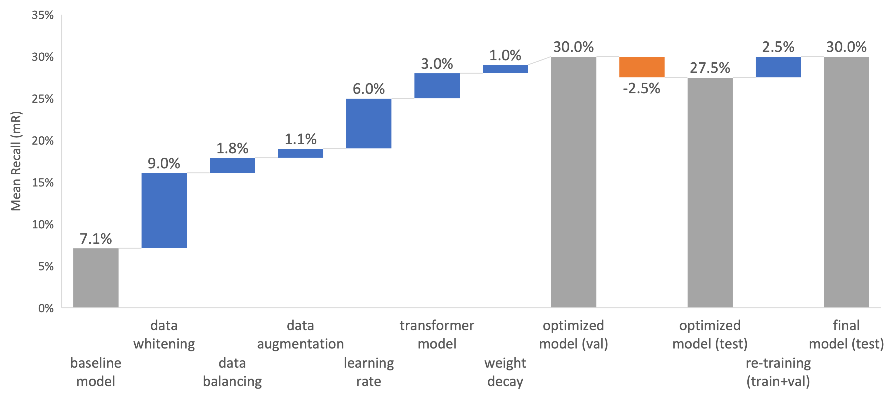

#  Image Object Relation Classification

NTU CE7454 Project: DEEP LEARNING FOR DATA SCIENCE

## Challenge Description

Most of the current computer vision tasks focus on the objects in the image. For example, image classification asks models to identify the object classes in the image. Object detection and image segmentation further require the model to identify objects in the image and find their locations (with different granularities). However, the information of **relations** are, by far, ignored by the community. Therefore, in this assignment, the PSG Classification Challenge, we would like to invite our students to explore how to train a computer vision model to well identify the relations in the images.

To be more specific, when the model sees the photo above, rather than providing the information of the objects (e.g., person, elephant), it should output **3 salient relations** such as *feeding*, *leaning-on*, and *looking-at*. There are 56 classes of relation in total. We notice that the first 6 relations (in gray) are too vague for PSG classification task, so we remove them in this project, so that the label space only contains 50 relations (in orange). In other word, the PSG classification task is a 50-class multi-label classification problem.

## Dataset

4500 training data, 500 validation data, and 500 test data. All the images and panoptic segmentation are from COCO dataset. Label imbalance is severe in datasets as below. To tackle the imbalance, images with frequent classes were under-sampled and images with infrequent classes were over-sampled.

Label Frequency in Train Set    |  Label Frequency in Val Set
:-------------------------:|:-------------------------:
  |  

Mean Recall (mR) is the main target metric to evaluate the model in this project. It measures the mean of recall vlues of 50 classes in the test dataset.

## Work Conducted

* An exploratory data analysis was first conducted to understand the relation class distribution. 
* Three **deep learning** models have been used in the project: ResNet50, ResNet101, and Swin Transformer. 
* The optimization and regularization techniques were applied for each model to improve the mean recall performance. The most effective measures included image augmentation, data whitening, learning rate adjustment, increasing binary cross-entropy loss weight for infrequent classes, and multiplying infrequent class prediction probabilities (i.e., reducing probability threshold). 
* The model was re-trained in the union of training and validation datasets before being submitted to the testing dataset. 
* **Multi-task** learning was implemented to leverage the semantic segmentation task to improve classification performance. 

* **Zero-shot** models were also proposed and explored to utilize the knowledge encapsulated in CLIP and Detectron2. Prompt engineering was performed for the relation classification. 
* My optimized model is based on Swin Transformer at a test mean recall of 32.4%.

